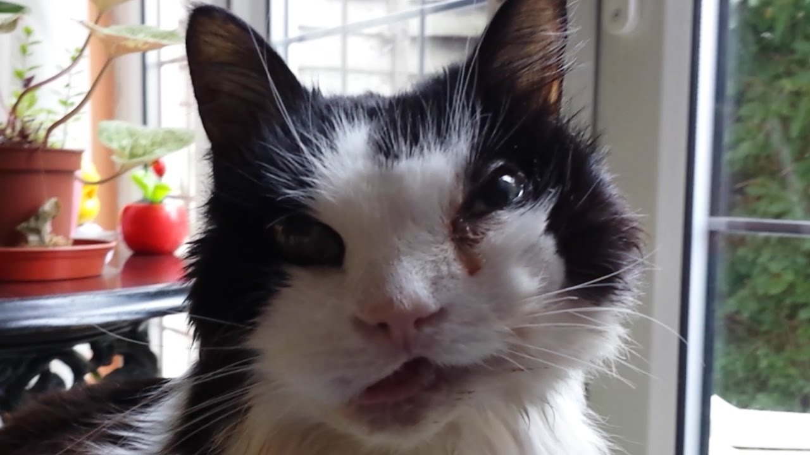

# What is this?
This site, and this markdown document, were among some of my first exercices as a web developer. We had to write a markdown document (this one) and then create it in HTML / CSS with some added effects. The whole thing went pretty well, I had a lot of fun.

# Me, Myself, and I - A little bit about myself
---
What do I look like ? Well, I look like this...

___
## This is my first page written in Markdown !

At first, let me give you my favorite latin quote that summarizes my train of thought pretty well:
>Docendo discimus

It means *"By teaching, we learn"*. It's a quote I try to live by.
***
## Some code
Since I'm here to study web development let me give you an example of two things I use for that:

#### Javascript (ECMAscript)

    console.log('Hello, world');

*This code prints 'Hello, world' to the console.*

#### HTML

    
I LOVE PEARL JAM !

*This code prints out 'I LOVE PEARL JAM' in your web browser.*

---
## My favorite animals
Here's a list of my favorite animals, ranked from most favorite to least favorite.

1. Cats
1. Whales
1. Humans
1. Otters
1. Lions

Here's a picture of my most favorite animal;

---
## Music

I have no creativity so I'll just give you an unordered list containing 4 of my favorite bands/singers by genre of music. I'll put my favorite song from each band/singer underneath them.

- Hip-Hop
  - Lomepal
    - 1000°C
  - Orelsan
    - Dis La Vérité (feat Lomepal)
  - Romeo Elvis
    - POGO
  - Jazzy Bazz
    - Fluctuat Nec Mergitur

- Rock
  - KORN
    - Blind
  - Nirvana
    - Rape Me
  - Pearl Jam
    - Evolution
  - Alice in Chains
    - The Rooster

- 50's Music
  - Frank Sinatra
    - Blue Moon
  - Peggy Lee
    - Why Don't You Do Right
  - The Ink Spots
    - I Don't Want To Set The World On Fire
  - Dean Martin
    - Ain't That A Kick In The Head

- Electro/DnB
  - Prodigy
    - Timebomb
  - Gessafelstein
    - Reset
  - Pendulum
    - Tarantula
  - Mr.Oizo
    - Flatbeat
---
## **And here's a little table with some of my favorite things;**

|Music|Technology|Sports|Movies|
|:---:|:---:|:---:|:---:|
|Metal|A.I.|Karate|Citizen Kane|
|Techno|Human Augmentation|Bodyweight Fitness|Indiana Jones|
|Rockabilly and funk|Immortality|Swimming|Any Anime really||
---
[click me! It's a link to my site written in french!](http://welovebecode.000webhostapp.com/)

The song I'm listening to right now:

